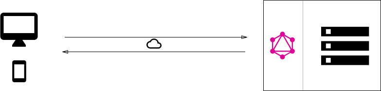

# What is GraphQL

- new API standard (alternative to REST)
- query language
- runtime
- developed & open-sourced by Facebook

---

# But why?

- need for efficient data loading
  - mainly for mobile
- faster development time
  - client can just modify query, no need for API change & release serverside

similar efforts 
- Netflix - opensourced `Falcor`
- Coursera dropped development and used GQL after being published

---

# Main selling points

- client decides exactly what data to return
  - solves overfetching (too much data)
- multiple resources in a single request
  - solves underfetching (not enough data in single req. -> more req.)
- evolve API without versions

---

# Other features

- analytics
  - what data is read by clients
- instrumenting / performance monitoring on resolver functions
- strong type system
  - schema as contract between client and server
  - can define schema first and than parallelize work on client and server
  - can easily mock defined schema structures to develop against

Difference between REST and GraphQL:

---

# Rest


---

# GraphQL


---

# Use cases

- GraphQL with database
- GraphQL with existing systems
- GraphQL hybrid with database and existing systems
  - legacy, db, 3rd party api's
  - all data management complexity to server

---

# GraphQL with database



---

# GraphQL with existing systems


---

# GraphQL hyrbid


---

# Resolver functions

- payload of GraphQL query consists of a set of fields
- each field corresponds to exactly one fn = resolver
  - single purpose of resolver is to fetch data for its field
- when server receives query it calls all the functions for the fields that are specified in payload
  - once all resolvers return, server packages data as described in query & send it back

---

# GraphQL resolvers


---

# Error handling

- successful response returns only a `data` field
- if request fails or partially fails than `errors` field is added to the response
  - list of errors, each error is a map
     - (`message` with error description)


```json
{
	"data": { ... },
	"errors": [
		{
			"message": "Name for character with ID 1002 could not be fetched.",
			"locations": [ { "line": 6, "column": 7 } ],
			"path": [ "hero", "heroFriends", 1, "name" ]
		}
	]
}
```

---

# Downsides

- response code always `200`
- server-side caching
  - not friends with GraphQL
- complexity
  - simple API with consistent data over time it's better to stick with REST

---

# Links

- Official website - [graphql.org/learn](https://graphql.org/learn)
- Tutorials - [howtographql.com](https://www.howtographql.com)
- Specification - [graphql.github.io/graphql-spec](https://graphql.github.io/graphql-spec/)